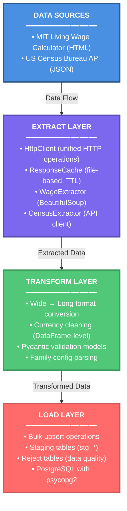

# Wage ETL Pipeline

>Automated ETL System for Economic Analysis

<h1 align="center">
  <br>
  <div>
    <a href="https://github.com/Carlomos7/Wage-ETL/issues">
        
    </a>
    <a href="https://github.com/Carlomos7/Wage-ETL/issues?q=is%3Aissue+is%3Aclosed">
        
    </a>
    <a href="https://github.com/Carlomos7/Wage-ETL">
        
    </a>
    <a href="https://github.com/Carlomos7/Wage-ETL">
        
    </a>
    <br>
  </div>
</h1>
<br>

A Python-based ETL system that extracts living wage and expense data from MIT's Living Wage Calculator and US Census Bureau API, transforms it from wide-format HTML tables to normalized long-format records, validates it using Pydantic models, and loads it into PostgreSQL staging tables with comprehensive error handling.

## Architecture Overview



## Key Features

- Web scraping with BeautifulSoup4 and Census API integration
- HTTP response caching with TTL-based expiration
- DataFrame-level data cleaning and currency normalization
- Strict schema validation with Pydantic v2
- Bulk PostgreSQL operations using COPY for performance
- Reject table handling for data quality tracking
- Idempotent pipeline design for safe re-runs
- Full test coverage with pytest

## Technologies Used

**Core Language & Runtime:**

- Python 3.13 (with comprehensive type hints)
- uv (modern, fast dependency resolver and package manager)

**Data Processing:**

- pandas 2.3.3 - Data manipulation and transformation
- Pydantic 2.12.4 - Data validation and modeling
- BeautifulSoup4 4.14.2 - HTML parsing for web scraping

**Database & Connectivity:**

- PostgreSQL 16 - Relational database for staging and analytics
- psycopg2-binary 2.9.11 - PostgreSQL adapter for Python

**HTTP & APIs:**

- requests 2.32.5 - HTTP library for API calls and web scraping

**Configuration & Settings:**

- PyYAML 6.0.3 - YAML configuration file parsing
- python-dotenv 1.2.1 - Environment variable management
- pydantic-settings 2.12.0 - Settings management with validation

**Local Development Setup:**

- Docker Compose - Container orchestration
- Flyway - Database migration management
- PostgreSQL 16 (containerized)

**Testing & Quality:**

- pytest 9.0.2 - Testing framework
- coverage.py 7.13.0 - Code coverage analysis

## Getting Started

These instructions will get you a copy of the project up and running on your local machine for development and testing purposes.

### Prerequisites

Before you begin, ensure the following tools are installed:

- **Python 3.13+**
- [**uv**](https://docs.astral.sh/uv/getting-started/installation/) (optional) — Modern Python package manager
- **Docker** — For local database and infrastructure setup
- **Git** — For cloning the repository

### Installing

1. **Clone the repository**

   ```bash
   git clone https://github.com/Carlomos7/Wage-ETL.git
   cd Wage-ETL
   ```

2. **Install dependencies**

   Using **uv** (recommended):

   ```bash
   uv sync
   ```

   Or using **pip**:

   ```bash
   python -m venv .venv
   source .venv/bin/activate   # On macOS/Linux
   # .venv\Scripts\activate    # On Windows (PowerShell)
   pip install .
   ```

   *(pip will read `pyproject.toml` and install the project along with its dependencies.)*

3. **Set up environment variables**
   Create a `.env` file in the project root:

   ```bash
   # Database Configuration
   DB_HOST=localhost
   DB_PORT=5432
   DB_NAME=wage_etl
   DB_USER=postgres
   DB_PASSWORD=your_password_here

   # Optional: Logging Configuration
   LOG_LEVEL=INFO
   LOG_TO_FILE=true
   ```

4. **Start the database infrastructure**

   ```bash
   docker-compose up -d
   ```

   This will start:

   - PostgreSQL 16
   - Flyway migrations
   - PgAdmin (optional, [http://localhost:5050](http://localhost:5050))

5. **Run the ETL pipeline**

   ```bash
   uv run -m main
   ```

   *(Or `python -m main` if installed with pip.)*

**Querying the data**

After running the pipeline, you can query the staging tables. See [SQL docs](sql/migrations/README.md) for example queries and monitoring options.

### Configuration

The pipeline is configured through YAML files and environment variables. The most important setting is the target states in [`config/config.yaml`](config/config.yaml):

```yaml
pipeline:
  target_states:
    - "NJ"  # Default - modify to process other states
    # - "NY"
    # - "CA"
    # - "TX"
```

For all configuration options, see [config docs](config/README.md).

## Running the tests with coverage

The project includes comprehensive unit and integration tests. Run them using pytest:

**Run all tests:**

```bash
uv run coverage run -m pytest # or just uv run pytest
```

**Run coverage report:**

```bash
uv run coverage report
```

**Generate HTML Coverage Report:**

```bash
uv run coverage html
```

**Generate HTML Coverage Report:**

```bash
uv run coverage erase
```

**View coverage report:**
After running with coverage, open `htmlcov/index.html` in your browser to see the detailed coverage report.

## Usage

### Basic Pipeline Execution

1. **Start the infrastructure** (if not already running):

   ```bash
   docker-compose up -d
   ```

2. **Run the ETL pipeline**:

   ```bash
   uv run -m main
   ```

The pipeline will:

- Extract county FIPS codes from the Census API for configured states
- Scrape wage and expense data from MIT Living Wage Calculator for each county
- Transform wide-format data to long format
- Validate data using Pydantic models
- Load valid records into staging tables (`stg_wages`, `stg_expenses`)
- Store invalid records in reject tables (`stg_wages_rejects`, `stg_expenses_rejects`)
- Track the run in `etl_runs` table with status and statistics

### Pipeline Flow

The ETL pipeline follows a three-stage process:

```mint
1. Extract
   ├── Census API → County FIPS codes
   └── Web Scraper → HTML tables per county

2. Transform
   ├── Parse HTML → Wide-format DataFrames
   ├── Validate → Pre-transform checks
   ├── Normalize → Long-format DataFrames
   └── Validate → Pydantic model conversion

3. Load
   ├── Accumulate → Combine all counties
   ├── Bulk COPY → Temporary tables
   ├── UPSERT → Staging tables (ON CONFLICT)
   ├── Load Rejects → Invalid records
   └── Update Run → etl_runs table
```

For more details on each stage, see the [pipeline doc](src/README.md).

### Monitoring Pipeline Execution

**View logs:**

- Console output: Real-time structured logs
- File logs: `logs/etl.log` and `logs/error.log`

**Query the database:**

See the [SQL docs](sql/migrations/README.md) for example SQL queries to check run status, view staging data, and monitor rejected records.

## Documentation

[Task Documentation](https://github.com/users/Carlomos7/projects/9)

- [src/](src/README.md) - ETL pipeline overview
  - [extract/](src/extract/README.md) - HTTP client, caching, scraping
  - [transform/](src/transform/README.md) - Wide→long, currency cleaning, Pydantic
  - [load/](src/load/README.md) - Bulk COPY, upserts, run tracking
- [config doc](config/README.md) - Settings, environment variables, YAML configuration
- [SQL doc](sql/migrations/README.md) - Database migrations (Flyway), schemas, and query examples

## Configuration

For detailed configuration documentation, see the [config doc](config/README.md). This includes:

- Complete YAML configuration reference (`config.yaml`)
- State FIPS mapping (`state_fips.json`)
- Common configuration changes and examples

## Data Sources

> Living wage data sourced from the MIT Living Wage Calculator https://livingwage.mit.edu.
This project is for educational purposes only and is not intended for large-scale scraping or redistribution of MIT Living Wage data.

- [**MIT Living Wage Calculator**](https://livingwage.mit.edu/) — Wage and expense tables per county.
- [**US Census Bureau API**]((https://www.census.gov/data/developers/data-sets.html)) — County FIPS codes & demographic metadata.

## Licensing

The code in this project is licensed under the MIT License.

See the [LICENSE](LICENSE) file for the full text of the license.

**Copyright (c) 2025 Carlos Ray Segarra**

## References

- TechWithQasim. *Building an ETL Pipeline for Web Scraping Using Python.*
  [https://dev.to/techwithqasim/building-an-etl-pipeline-for-web-scraping-using-python-2381](https://dev.to/techwithqasim/building-an-etl-pipeline-for-web-scraping-using-python-2381)
- CodeWithHannan. *Python for ETL Pipelines: Building Modular, Testable, and Reliable Data Workflows.*
  [https://medium.com/@CodeWithHannan/python-for-etl-pipelines-building-modular-testable-and-reliable-data-workflows-0f1768428244](https://medium.com/@CodeWithHannan/python-for-etl-pipelines-building-modular-testable-and-reliable-data-workflows-0f1768428244)
- DataJournal. *DOs and DON'Ts of Web Scraping in 2025.*
  [https://medium.com/@datajournal/dos-and-donts-of-web-scraping-e4f9b2a49431](https://medium.com/@datajournal/dos-and-donts-of-web-scraping-e4f9b2a49431)
- Census Bureau. *Census API User Guide.*
  [https://www.census.gov/data/developers/guidance/api-user-guide.html](https://www.census.gov/data/developers/guidance/api-user-guide.html)
- Pydantic Team. *Pydantic Settings Management Documentation.*
  [https://docs.pydantic.dev/latest/concepts/pydantic_settings/](https://docs.pydantic.dev/latest/concepts/pydantic_settings/)
- ArjanCodes / Testing Tutorial. *How to Mock psycopg2 with pytest for Efficient Database Testing.*
  [https://www.youtube.com/watch?v=Z2jjKsSp6M0](https://www.youtube.com/watch?v=Z2jjKsSp6M0)
- Real Python. *Inheritance and Composition: A Python OOP Guide.*
  [https://realpython.com/inheritance-composition-python/](https://realpython.com/inheritance-composition-python/)
