# Wage ETL Pipeline ~ Drafted

TODO: UPDATE THIS BEFORE DUE DATE

A production-ready ETL pipeline that extracts living wage data from MIT's Living Wage Calculator and county reference data from the US Census Bureau API, validates and cleans the data, then loads it into PostgreSQL for analysis.

## Overview

This project automates the collection and processing of living wage data for US counties. It scrapes hourly wage rates (living, poverty, minimum) and annual expense breakdowns for different family configurations, validates the data using Pydantic schemas, and stores it in a structured format for analysis.

**Key Features:**

- 🔄 **Idempotent ETL**: Safe to re-run without creating duplicates
- ✅ **Data Validation**: Pydantic-based validation with business rule checks
- 📊 **Structured Storage**: CSV staging files organized by year and state
- 🔍 **Error Handling**: Comprehensive logging and error tracking
- ⚡ **Caching**: HTTP response caching to reduce API calls
- 🐳 **Docker Support**: PostgreSQL database with Docker Compose
- 🧪 **Test Coverage**: Comprehensive test suite with pytest

## System Architecture

```mermaid
graph TB
    subgraph External["Data Sources"]
        Census[Census API]
        MIT[MIT Website]
    end
    
    subgraph Extract["Extract ✓"]
        API[API Extractor<br/>+ Cache]
        Scraper[Web Scraper<br/>+ Cache + Retry]
    end
    
    subgraph Transform["Transform"]
        Clean[Clean]
        Validate[Validate ✓]
        Dedupe[Dedupe]
    end
    
    subgraph Load["Load"]
        CSV[CSV Files ✓]
        DB[(PostgreSQL →)]
    end
    
    Census --> API
    MIT --> Scraper
    API --> Clean
    Scraper --> Clean
    Clean --> Validate
    Validate --> Dedupe
    Dedupe --> CSV
    Dedupe -.-> DB
    
    style External fill:#e3f2fd
    style Extract fill:#c8e6c9
    style Transform fill:#fff3cd
    style Load fill:#e8f5e9
```



### Core Layers

| Layer            | Purpose                                    | Key Technology                   |
| ---------------- | ------------------------------------------ | -------------------------------- |
| **Extract**      | Fetch data from Census API and MIT website | `requests`, `BeautifulSoup`      |
| **Transform**    | Clean, validate, and deduplicate data      | `pandas`, `Pydantic`             |
| **Load**         | Store data in CSV files                    | `pandas`                         |
| **Config**       | Manage settings and connections            | `pydantic-settings`, `python-dotenv` |
| **Models**       | Define data schemas                        | `Pydantic`                       |

## Installation

### Prerequisites

- **Python 3.13+**
- **uv** (fast Python package manager)
- **Docker & Docker Compose** (for PostgreSQL database)

### Setup

1. **Clone the repository:**

   ```bash
   git clone <repository-url>
   cd Living-Wage-ETL
   ```

2. **Install dependencies using uv:**

   ```bash
   uv sync
   ```

3. **Set up environment variables:**

   ```bash
   cp .env.example .env
   # Edit .env with your database credentials
   ```

4. **Start PostgreSQL database (optional):**

   ```bash
   docker-compose -f docker-compose.dev.yml up -d
   ```

## Configuration

### Environment Variables

Create a `.env` file in the project root with the following variables:

```env
# Database Configuration
DB_HOST=localhost
DB_PORT=5432
DB_NAME=wage_etl
DB_USER=postgres
DB_PASSWORD=your_password

# Optional: Application Settings
ENVIRONMENT=development
LOG_LEVEL=INFO
```

### Configuration Files

- **`config/config.yaml`**: API endpoints, timeouts, retry settings
- **`config/state_fips.json`**: State FIPS code mappings
- **`.env`**: Sensitive credentials (not in git)

### Configuration Priority

Settings are loaded in this order (later values override earlier):

1. Environment variables
2. `.env` file
3. `config/config.yaml`
4. Default values

## Usage

### Running the Pipeline

```bash
# Activate the virtual environment (if using uv)
source .venv/bin/activate  # On Windows: .venv\Scripts\activate

# Run the main pipeline
python main.py
```

The pipeline will:

1. Fetch county FIPS codes from the Census API
2. Scrape living wage data from MIT's website for each county
3. Transform and validate the data
4. Save to CSV files in `data/raw/{year}/`

### Output Files

Data is saved to:

- **Wages**: `data/raw/{year}/wage_rates_{state_fips}.csv`
- **Expenses**: `data/raw/{year}/expense_breakdown_{state_fips}.csv`

### Example Output Structure

```csv
county_fips,Category,1 Adult - 0 Children,1 Adult - 1 Children,...
001,Living Wage,$24.25,$44.85,...
001,Poverty Wage,$7.52,$10.17,...
001,Minimum Wage,$15.49,$15.49,...
```

## Project Structure

```mint
Living-Wage-ETL/
│
├── config/                    # Configuration management
│   ├── config.yaml            # API and pipeline settings
│   ├── settings.py            # Pydantic settings loader
│   ├── models.py              # Configuration models
│   ├── logging.py             # Logging setup
│   └── state_fips.json        # State FIPS mappings
│
├── src/
│   ├── extract/               # Data extraction layer
│   │   ├── census_api.py      # Census API client
│   │   ├── wage_scraper.py    # MIT website scraper
│   │   ├── http.py            # HTTP client with retry logic
│   │   ├── cache.py           # Response caching
│   │   └── extract_ops.py     # Extraction operations
│   │
│   └── transform/             # Data transformation layer
│       ├── pandas_ops.py      # DataFrame operations
│       └── csv_utils.py        # CSV storage utilities
│
├── tests/                     # Test suite
│   ├── test_census_api.py
│   ├── test_wage_scraper.py
│   └── ...
│
├── data/                      # Data storage (gitignored)
│   ├── raw/                   # Raw scraped data
│   ├── processed/             # Processed data
│   └── cache/                 # HTTP response cache
│
├── main.py                    # Pipeline orchestrator
├── pyproject.toml             # Project dependencies
├── docker-compose.dev.yml     # PostgreSQL setup
└── README.md                  # This file
```

## Data Sources

### US Census Bureau API

**Endpoint:** `https://api.census.gov/data/2023/acs/acs5`

**What's Fetched:**

- County names
- State FIPS codes
- County FIPS codes
- Full FIPS codes (state + county)

**Example Response:**

```json
[
  ["NAME", "state", "county"],
  ["Atlantic County, New Jersey", "34", "001"],
  ["Bergen County, New Jersey", "34", "003"]
]
```

**Why This Matters:**

- MIT URLs require FIPS codes: `https://livingwage.mit.edu/counties/34001`
- Provides standardized county identifiers
- Enables validation and cross-referencing

### MIT Living Wage Calculator

**Base URL:** `https://livingwage.mit.edu`

**What's Scraped:**

- Two HTML tables per county page
- **Table 1**: Hourly wage rates (Living Wage, Poverty Wage, Minimum Wage)
- **Table 2**: Annual expense breakdowns (Food, Childcare, Housing, etc.)

**Family Configurations (12 total per county):**

- 1 adult: 0, 1, 2, 3 children
- 2 adults (1 working): 0, 1, 2, 3 children
- 2 adults (both working): 0, 1, 2, 3 children

**Expected Records:**

- 12 wage records per county
- 12 expense records per county
- **Total for 21 NJ counties:** 504 records (252 wages + 252 expenses)

## ETL Process

### Phase 1: Extract

#### Census API Extraction

1. Send GET request to Census API for target state counties
2. Parse JSON response (skip header row)
3. Extract county name, state code, county code
4. Build full FIPS code (state + county)
5. Clean county names (remove state suffix)

#### MIT Website Scraping

1. Load county FIPS codes from Census API
2. Build MIT URLs: `https://livingwage.mit.edu/counties/{fips_code}`
3. Send HTTP GET request with rate limiting
4. Parse HTML with BeautifulSoup
5. Extract two tables: `table.results_table`
6. Map 12 columns to family configurations
7. Add metadata (county name, FIPS, scrape date)

**Rate Limiting:**

- Configurable delay between requests (default: 1-3 seconds)
- Prevents overwhelming the MIT website

### Phase 2: Transform

#### Clean

- **Currency Fields**: Remove `$` and commas, convert to float
- **String Fields**: Strip whitespace, standardize capitalization
- **Integer Fields**: Convert strings to integers
- **Date Fields**: Standardize to YYYY-MM-DD format

#### Validate

Validation rules enforced:

- ✅ Required fields present (county_name, fips_code, wage fields)
- ✅ Data types correct (integers, floats, dates)
- ✅ Value ranges valid (adults: 1-2, children: 0-3, wages > 0)
- ✅ Business logic (working_adults ≤ adults)
- ✅ Reference data exists (county in valid list, FIPS exists)

#### Deduplicate

- Track seen combinations using `(county, adults, working_adults, children)`
- Keep first occurrence, flag subsequent matches
- Prevents duplicate records in output

### Phase 3: Load

#### CSV Storage

- **Idempotent Upsert**: Replace existing county data, append new counties
- **Index Cache**: Fast lookup to check if county already exists
- **Organized by Year**: Files stored in `data/raw/{year}/`
- **Separate Files**: Wages and expenses in separate CSVs

#### File Naming

- Wages: `wage_rates_{state_fips}.csv`
- Expenses: `expense_breakdown_{state_fips}.csv`

## Development

### Running Tests

```bash
# Run all tests
pytest
```

### Code Quality

```bash
# Lint code
pylint src/
```

### Logging

Logs are written to:

- **Console**: Standard output (all environments)
- **File**: `logs/` directory (production/testing)

Log levels:

- `DEBUG`: Detailed diagnostic information
- `INFO`: General informational messages
- `WARNING`: Warning messages
- `ERROR`: Error messages
- `CRITICAL`: Critical errors

## Database Schema (Future)

The project is designed to support PostgreSQL loading. Planned tables:

### Dimensional Tables

- **`dim_state`**: State reference codes
- **`dim_county`**: County reference table with FIPS codes

### Staging Tables

- **`stg_wages`**: Living wage data (hourly rates)
- **`stg_expenses`**: Annual expense breakdowns

### Reject Tables

- **`stg_wages_rejects`**: Invalid wage records with rejection reasons
- **`stg_expenses_rejects`**: Invalid expense records

## Caching

HTTP responses are cached to:

- Reduce API calls during development
- Speed up re-runs
- Respect rate limits

**Cache Configuration:**

- Census API: 90 days TTL
- MIT Website: 30 days TTL
- Location: `data/cache/`

**Cache Management:**

- Expired cache files are automatically cleared
- Cache can be disabled per extractor instance

## Error Handling

The pipeline includes comprehensive error handling:

- **HTTP Errors**: Retry logic with exponential backoff
- **Parsing Errors**: Graceful degradation with logging
- **Validation Errors**: Records logged to reject tables (future)
- **Network Errors**: Configurable timeout and retry settings

## Performance Considerations

- **Rate Limiting**: Configurable delays between requests
- **Caching**: HTTP response caching reduces redundant calls
- **Index Cache**: Fast CSV lookups without full file reads
- **Batch Processing**: Process counties sequentially with progress tracking

## Contributing

1. Fork the repository
2. Create a feature branch (`git checkout -b feature/amazing-feature`)
3. Commit your changes (`git commit -m 'Add amazing feature'`)
4. Push to the branch (`git push origin feature/amazing-feature`)
5. Open a Pull Request

## License

[Add your license here]

## Acknowledgments

- **MIT Living Wage Calculator**: Data source for living wage calculations
- **US Census Bureau**: County reference data and FIPS codes

## Support

For issues and questions:

- Open an issue on GitHub
- Check existing issues for solutions
- Review the test files for usage examples

---

**Built with:** Python 3.13, Pydantic, pandas, BeautifulSoup, requests, uv
