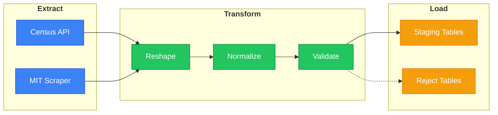

# src/

ETL pipeline for living wage data. Three layers:
> extract → transform → load.

```mint
src/
├── __init.py__
├── extract/      # Data Retrieval (Census API, MIT scraper)
├── transform/    # Cleaning, reshaping, validation
└── load/         # PostgreSQL staging tables
```



## Pipeline Flow

### Extract Stage

- Fetches county FIPS codes from the US Census Bureau API for configured states
- Scrapes wage and expense data from MIT Living Wage Calculator for each county
- Uses HTTP caching to avoid redundant requests
- Handles retries and errors gracefully

### Transform Stage

- Parses HTML tables into wide-format pandas DataFrames
- Performs pre-transform validation checks
- Converts wide-format data to normalized long format
- Cleans currency strings and normalizes values
- Validates data using Pydantic models

### Load Stage

- Accumulates transformed data from all counties
- Uses PostgreSQL COPY for efficient bulk loading
- Performs upserts to staging tables using ON CONFLICT
- Stores invalid records in reject tables with error details
- Tracks each run in the `etl_runs` table with status and statistics

## Package Docs

- [extract/](extract/README.md) - HTTP client, caching, scraping
- [transform/](transform/README.md) - Wide→long, currency cleaning, Pydantic validation
- [load/](load/README.md) - Bulk COPY, upserts, run tracking
