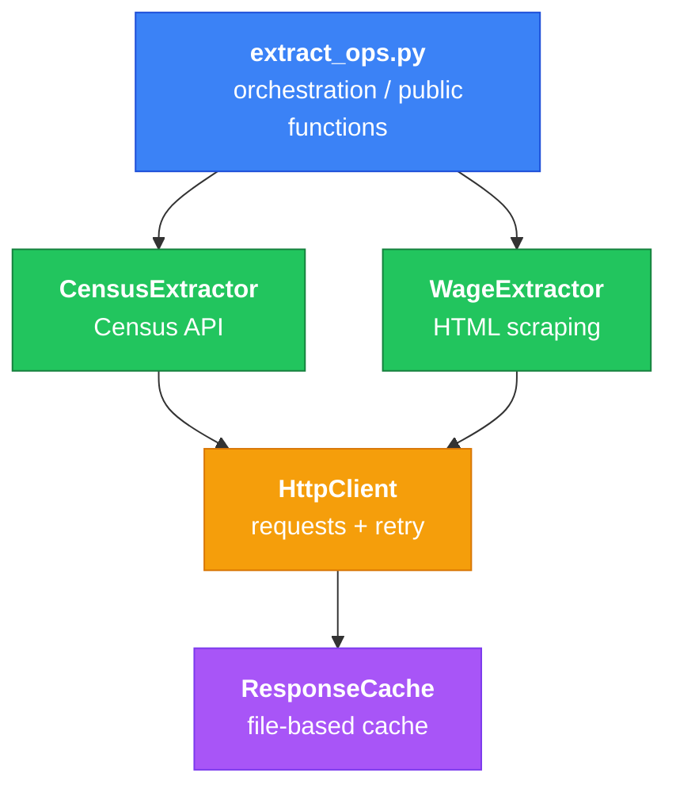

# Extract Layer

Data retrieval from the US Census Bureau API and MIT's Living Wage Calculator.

```mint
src/extract/
├── __init__.py
├── cache.py           # ResponseCache - file-based HTTP caching
├── http.py            # HttpClient - HTTP operations with retry
├── census_api.py      # CensusExtractor - Census Bureau API
├── wage_scraper.py    # WageExtractor - MIT Living Wage scraper
└── extract_ops.py     # Orchestration functions
```



## Usage

```python
from src.extract import get_all_counties, scrape_state_counties

# Get county reference data for target states (from config)
counties = get_all_counties()

# Scrape wages - yields results, doesn't load all into memory
for result in scrape_state_counties("34", ["001", "003", "005"]):
    if result.success:
        process(result.wages_data, result.expenses_data)
    else:
        log_error(result.fips_code, result.error)
```

## Output Formats

**Census counties:**

```python
{
    "county_name": "Atlantic County",
    "state_fips": "34",
    "county_fips": "001",
    "full_fips": "34001"
}
```

**Wage/expense rows** (wide format, one row per category):

```python
{
    "Category": "Living Wage",
    "1 Adult - 0 Children": "$18.71",
    "1 Adult - 1 Child": "$38.87",
    "2 Adults (1 Working) - 2 Children": "$42.43",
    # ... more household configurations
    "county_fips": "001"
}
```

**ScrapeResult:**

```python
ScrapeResult(
    fips_code="34001",
    success=True,
    wages_data=[...],      # list of row dicts
    expenses_data=[...],   # list of row dicts  
    page_updated_at=datetime(2024, 1, 15),
    error=None
)
```

The transform layer will normalize the wide format into long format and cleans currency strings.

## Design Decisions

- **Extractors own an HttpClient, not inherit from one** - HTTP logic stays in one place. Extractors only focus on parsing their data format (JSON for Census, HTML for MIT).

- **Caching lives in HttpClient** - Extractors don't know caching exists. HttpClient checks the cache before making a request, stores responses after.

- **ScrapeResult wrapper** - Each county scrape returns a result object with success/failure status. If one county fails, the pipeline keeps going instead of crashing.

- **Generators for large batches** - `scrape_state_counties` yields results one at a time instead of building a list. Memory usage stays low even when scraping multiple counties/states.
