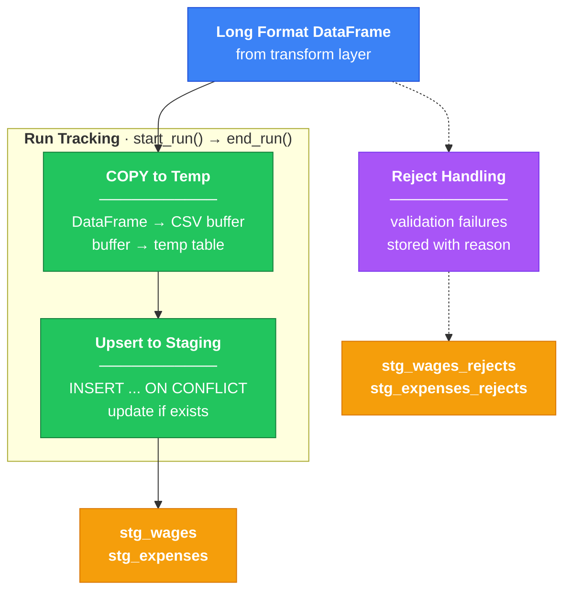

# Load Layer

Loads transformed data into PostgreSQL staging tables with run tracking and reject handling.

```mint
src/load/
├── __init__.py
├── db.py              # Connection management
├── bulk_ops.py        # COPY operations, column definitions
├── run_tracker.py     # ETL run tracking
└── staging.py         # Staging table operations
```



## Usage

```python
from src.load import (
    start_run, end_run,
    bulk_upsert_wages, bulk_upsert_expenses,
    load_rejects
)

# Start tracking
run_id = start_run(state_fips="34")

# Load data
wages_count = bulk_upsert_wages(wages_df, run_id)
expenses_count = bulk_upsert_expenses(expenses_df, run_id)

# Handle rejects
load_rejects(reject_records, run_id, "stg_wages_rejects")

# Finish with stats
end_run(
    run_id,
    status="SUCCESS",
    wages_loaded=wages_count,
    expenses_loaded=expenses_count
)
```

## Data Flow

**Input** (long format from transform layer):

```python
{
    "county_fips": "34001",
    "page_updated_at": date(2024, 1, 15),
    "adults": 1,
    "working_adults": 1,
    "children": 0,
    "wage_type": "living",
    "hourly_wage": 18.71
}
```

**Output** (staging tables):

- `stg_wages` - wage records with `run_id` and `load_timestamp`
- `stg_expenses` - expense records with `run_id` and `load_timestamp`
- `stg_wages_rejects` - failed records with `raw_data` and `rejection_reason`
- `stg_expenses_rejects` - failed records with `raw_data` and `rejection_reason`
- `etl_runs` - run metadata (status, counts, timestamps)

## Design Decisions

- **COPY to temp, then upsert** - Postgres `COPY` is much faster than row-by-row inserts using a `for` loop. Load into a temp table first, then `INSERT ... ON CONFLICT` to handle duplicates.

- **Staging tables with rejects** - Bad records go to reject tables instead of failing the whole load. Each reject stores the raw data and why it failed, so you can fix and reload.

- **Run tracking** - Every load gets a `run_id`. Makes it easy to see what loaded when, roll back a bad run, or debug issues.

- **Context managers for connections** - `get_connection()` handles commit/rollback automatically. No forgotten commits or leaked connections.

- **Whitelist for table names** - `load_rejects()` uses a [`frozenset`](https://www.w3schools.com/python/ref_func_frozenset.asp) of allowed table names. It's a set that can't be modified after creation, so the whitelist stays locked. Prevents SQL injection when the table name comes from a variable.
