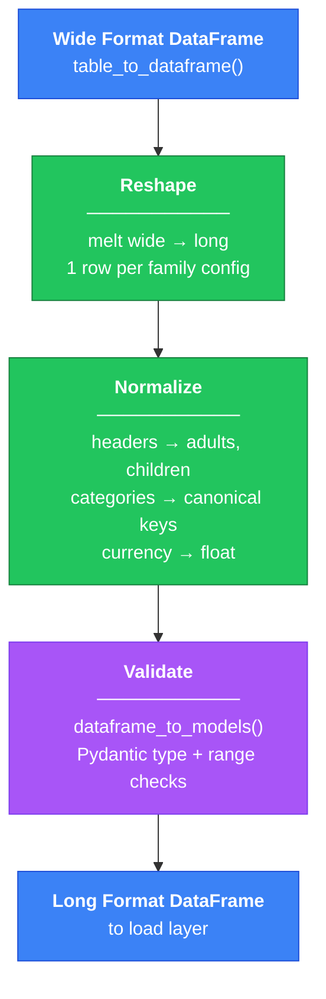

# Transform Layer

Converts raw extracted data (wide format, currency strings) into normalized records ready for database loading.

```mint
src/transform/
├── __init__.py
├── constants.py       # Lookup maps (family configs, categories)
├── models.py          # Pydantic models (WageRecord, ExpenseRecord)
├── normalizers.py     # Header/category parsing functions
├── pandas_ops.py      # DataFrame operations, main entry points
├── validation.py      # Pre/post validation
└── csv_utils.py       # CSV persistence utilities
```



## Usage

```python
from src.transform import normalize_wages, normalize_expenses, table_to_dataframe

# From extract layer output
wages_df = table_to_dataframe(scrape_result.wages_data)
expenses_df = table_to_dataframe(scrape_result.expenses_data)

# Transform: wide tp long, clean currencies, validate
clean_wages = normalize_wages(
    wages_df,
    state_fips="34",
    county_fips="001",
    page_updated_at=scrape_result.page_updated_at
)

clean_expenses = normalize_expenses(
    expenses_df,
    state_fips="34",
    county_fips="001", 
    page_updated_at=scrape_result.page_updated_at
)
```

## Data Flow

**Input** (wide format from extract layer):

```python
{
    "Category": "Living Wage",
    "1 Adult - 0 Children": "$18.71",
    "1 Adult - 1 Child": "$38.87",
    "2 Adults (1 Working) - 2 Children": "$42.43",
    ...
    "county_fips": "001"
}
```

**Output** (long format, one row per family config):

```python
# WageRecord
{
    "county_fips": "34001",      # full FIPS (state + county)
    "page_updated_at": date(2024, 1, 15),
    "adults": 1,
    "working_adults": 1,
    "children": 0,
    "wage_type": "living",       # normalized from "Living Wage"
    "hourly_wage": 18.71         # cleaned from "$18.71"
}

# ExpenseRecord
{
    "county_fips": "34001",
    "page_updated_at": date(2024, 1, 15),
    "adults": 1,
    "working_adults": 1,
    "children": 0,
    "expense_category": "housing",  # normalized
    "annual_amount": 15840.0        # cleaned from "$15,840"
}
```

## Design Decisions

- **[`pandas.melt`](https://pandas.pydata.org/docs/reference/api/pandas.melt.html) over [`pandas.wide_to_long`](https://pandas.pydata.org/docs/reference/api/pandas.wide_to_long.html)** - `wide_to_long` needs columns that follow a pattern it can split, like a prefix and year However, the headers are messy strings. For my use case, I found it easier to `melt` first, then parse with a lookup map.

- **Lookup maps over regex** - I could have parsed `"2 Adults (1 Working) - 2 Children"` with regex. Instead, `FAMILY_CONFIG_MAP` lists every valid header. If MIT changes their format, I can just add a key instead of debugging regex.

- **Validate after cleaning** - Can't check if `"$18.71"` is a valid float. Strip the `$` first, then validate. Pydantic also catches things pandas can't, like `working_adults > adults`.

- **Column operations** - Currency cleaning runs on all related columns at once, not row by row. Faster when processing thousands of records.
